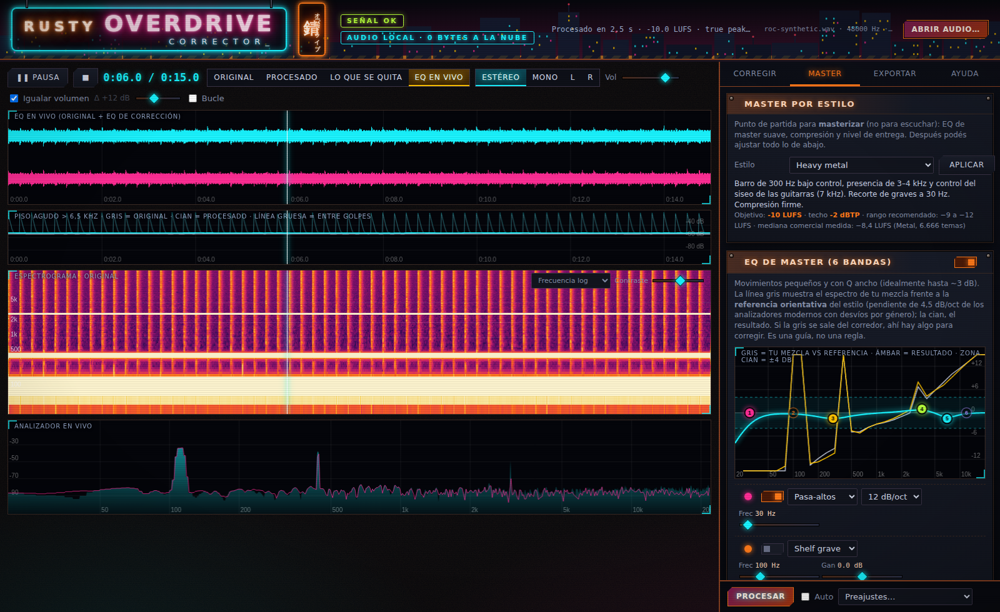

# Rusty Overdrive Corrector

**Corrector y masterizador de audio que corre entero en tu navegador.** Sin instalar nada, sin subir tu música a ningún servidor: abrís un archivo HTML, cargás un WAV o MP3, limpiás, masterizás y exportás.

<p align="center"></p>

Está pensado para cualquier material: una mezcla propia que querés pulir y dejar lista para Spotify, una pista con siseo o ruido de fondo, o un archivo que necesita un último pase antes de entregarlo a un distribuidor.

> **📣 Se buscan colaboradores.** Necesitamos **oído y oficio** tanto como código: ingenieros de mezcla y mastering, productores, gente que pruebe los estilos de master en su género, y desarrolladores de audio/JavaScript. Si algo no suena bien o no se entiende, abrí un *issue* con las plantillas «Mejora o duda», «Error o artefacto» u «Oído y preajustes». Empezá por el **[manual de usuario](docs/MANUAL.md)** y por [CONTRIBUTING.md](CONTRIBUTING.md).

> **Estado:** versión 0.1, primera publicación. Los cálculos están verificados con números (ver [Cómo se verificó](#cómo-se-verificó)), pero el juicio final es siempre del oído: ninguna herramienta reemplaza escuchar. Buscamos gente con oído y oficio que ayude a mejorarla.

## Qué incluye

**Escucha y análisis**
- Onda estéreo con zoom, espectrograma, analizador en vivo y un gráfico del *piso agudo* que muestra cuándo sube el siseo entre golpes.
- Reproductor con mover la línea de tiempo con el mouse, bucle por región, y monitor **Estéreo / Mono / L / R** para revisar la mezcla como en un estudio.
- Comparación **Original / Procesado / Lo que se quita** (diferencia con nivel igualado), con **volumen igualado** (lo más fuerte siempre suena mejor: la comparación es justa) y escucha de la diferencia (se amplifica sola para que se oiga).

**Corrección**
- **EQ de 6 bandas con bolitas arrastrables** sobre el gráfico (frecuencia y ganancia; rueda = Q; doble clic = encender/apagar; clic derecho = escuchar solo esa zona) y **EQ en vivo** sin procesar, con tres escuchas: **Con EQ**, **Solo lo que quita** y **Solo la banda**. Bajás una campana con Q alto, la barrés por el espectro y, cuando oís justo el sonido molesto, encontraste la frecuencia.
- **Neon Scalpel**: EQ dinámico de 4 bandas (umbral, ratio, ataque, liberación; bajar al pasar, bajar al caer o subir al pasar). Ideal para sibilancia y resonancias que aparecen a veces.
- Supresión de **tonos persistentes** (picos estrechos que se repiten en todo el tema), **reducción de ruido** estacionario, **de-esser** de banda ancha y control de **colas agudas** (hi-hats y platillos que no terminan de decaer).

**Master**
- **Master por estilo** (EDM, rock, heavy metal, pop, clásica, jazz, folk y un estándar neutro para plataformas): EQ de master suave, compresión y nivel de entrega, con [fuentes documentadas](docs/ESTILOS.md).
- **Referencia tonal orientativa** sobre el EQ de master: ves tu espectro promedio contra un corredor de ±4 dB del estilo elegido.
- Compresor de bus, **limitador true-peak** con lookahead y normalización a **LUFS** objetivo.
- Medidor BS.1770-4 (integrado, corto plazo, momentáneo, LRA, true peak) y **simulador de plataformas** (cuánto subirían o bajarían Spotify, YouTube y Apple Music tu master).

**Exportación**
- **MP3 320 kbps / 44,1 kHz / estéreo** (lo que pide RouteNote), WAV de 16 o 24 bit. El MP3 se decodifica de nuevo para medir el true peak real y, si hace falta, se baja unas décimas y se recodifica.

## Empezar

📖 **Manual de usuario paso a paso: [docs/MANUAL.md](docs/MANUAL.md)** (incluye cómo encontrar una frecuencia molesta sin procesar, cómo limpiar siseo y cómo preparar el archivo para Spotify y RouteNote).

1. Abrí `dist/rusty-overdrive-corrector.html` (o `docs/index.html`; con GitHub Pages activado: <https://nyxxen.github.io/Rusty-Overdrive/>) con **Chrome, Edge o Firefox**. Es un único archivo autocontenido.
2. Arrastrá un WAV, MP3 o FLAC.
3. En **Corregir** activá lo que necesites y tocá **Procesar** (o marcá *Auto*).
4. Alterná **Original / Procesado / Lo que se quita** mientras escuchás.
5. En **Master** elegí un estilo, ajustá y mirá LUFS y techo. Después, **Exportar**.

Atajos: `Espacio` play/pausa · `1 2 3 4` original / procesado / lo que se quita / EQ en vivo · `M` mono/estéreo · `L` bucle · `← →` ±5 s · rueda = zoom · `Shift`+arrastre = región de bucle.

Todo el procesamiento ocurre en tu computadora. Un tema de 5 minutos usa del orden de 0,8 GB de memoria mientras está abierto (varias copias estéreo de 32 bit, cálculo aproximado).

## Cómo se verificó

El motor de audio se probó con señales sintéticas de respuesta conocida y contra herramientas de referencia (`node tests/run.js`, 26 pruebas):

| Qué | Cómo | Resultado |
|---|---|---|
| Loudness BS.1770-4 | tres señales contra pyloudnorm (incluye compuerta relativa) | diferencia < 0,05 LU |
| True peak | señal a fs/4 con fase de 45° (pico entre muestras) | 0,1 dBTP medido vs −3,0 dBFS de muestra |
| Motor espectral | reconstrucción con fuerza cero | error −150 dBFS |
| EQ dinámico | tonos por tramos de nivel conocido | −11,25 dB medidos vs −11,25 dB por fórmula |
| EQ paramétrico | ruido a través de 4 bandas vs respuesta teórica | error máx. 0,01 dB |
| Remuestreo 48 → 44,1 kHz | senos de 1 / 20 / 23,5 kHz | 0,00 / −0,08 / −93 dB |
| Limitador | objetivo −8 LUFS con techo −1 dBTP | dentro de 0,15 LU del objetivo, pico ≤ −0,95 dBTP |
| Exportación | MP3 320 kbps y WAV | tamaños y cabeceras correctos |

Además hay pruebas de navegador (`tests/e2e/e2e.js` y `tests/e2e/live-eq.js`, esta última comprueba el EQ en vivo con ruido blanco): abrir, procesar, arrastrar una bolita, comprobar que el filtro en vivo la sigue, aplicar un estilo y exportar un MP3.

## Limitaciones (a conciencia)

- **Los números no reemplazan al oído.** Que un módulo haga lo que dice no significa que suene bien en tu material. Los preajustes son puntos de partida, no reglas.
- Los estilos de master combinan datos medidos (loudness por género) con criterio de masterización habitual (movimientos de EQ pequeños). La **referencia tonal** es orientativa. Ver [docs/ESTILOS.md](docs/ESTILOS.md).
- El EQ es de fase mínima (no lineal). El de-esser, la reducción de ruido y las colas agudas son procesos espectrales: bien calibrados ayudan; pasados de rosca dejan artefactos ("burbujeo", agudos apagados).
- El EQ en vivo escucha **solo** el EQ de corrección aplicado al original; el resto de los módulos (ruido, de-esser, colas, Neon Scalpel) se escucha al tocar *Procesar*.
- Probado en Chromium. Firefox y Safari deberían funcionar, pero no se probaron.
- Probado con archivos de hasta 5 minutos; los más largos usan proporcionalmente más memoria y tiempo de proceso.

## Compilar y probar

No hay dependencias de ejecución. Con Node ≥ 18:

```bash
node build.js        # arma dist/rusty-overdrive-corrector.html y docs/index.html
node tests/run.js    # pruebas del motor (rápidas, sin audio privado)
npm i -D playwright-core && CHROME_PATH=/ruta/a/chrome node tests/e2e/e2e.js   # prueba de navegador
```

## Estructura

```
src/dsp/    motor de audio (corre en un Web Worker): FFT, tonos, espectral, dinámica, EQ dinámico, LUFS, remuestreo, exportación
src/ui/     interfaz: estado y estilos de master, audio, dibujo, editor de EQ, paneles, acciones
src/style/  tema cyberpunk
vendor/     codificador MP3 (lamejs, LGPL-3.0) — ver THIRD_PARTY_NOTICES.md
tests/      pruebas del motor, referencias y prueba de navegador
docs/       arquitectura, fuentes de los estilos, guía para publicar
```

Más detalle en [docs/ARQUITECTURA.md](docs/ARQUITECTURA.md).

## Cómo contribuir

Este proyecto nace con la idea de que **con especialistas en audio se puede llegar a una corrección profesional y eficiente**. Toda ayuda cuenta: código, oído, datos, traducciones, reportes de artefactos. Leé [CONTRIBUTING.md](CONTRIBUTING.md). Algunas ideas:

- Traducir la interfaz (hoy las cadenas están en `src/ui/*.js`; falta un sistema de idiomas ES/EN).
- EQ de fase lineal y procesamiento **Mid/Side** por banda.
- Versión en tiempo real del EQ dinámico con `AudioWorklet`.
- Exportación **FLAC**, *noise shaping* en el dither, limitador con sobremuestreo.
- Calibrar y validar los preajustes de estilo con oyentes y material real de cada género.
- Reducción de ruido más fina (perfil elegido a mano, pincel espectral).

## Idioma

La interfaz está en español. Chrome puede traducir la página (clic derecho → *Traducir a…*) porque el HTML declara `lang="es"`, pero la traducción automática no es perfecta con textos generados dinámicamente. Un sistema de idiomas propio es una buena primera contribución.

## Créditos y licencias

- Código: [MIT](LICENSE).
- Codificador MP3: `lamejs` / LAME, **LGPL-3.0**, incluido sin modificar en `vendor/` ([aviso](THIRD_PARTY_NOTICES.md)).
- *Neon Scalpel* es una implementación propia del concepto de EQ dinámico; no está afiliada a ni copia ningún producto comercial.
- Objetivos de loudness y criterios de master: ver las fuentes en [docs/ESTILOS.md](docs/ESTILOS.md).
